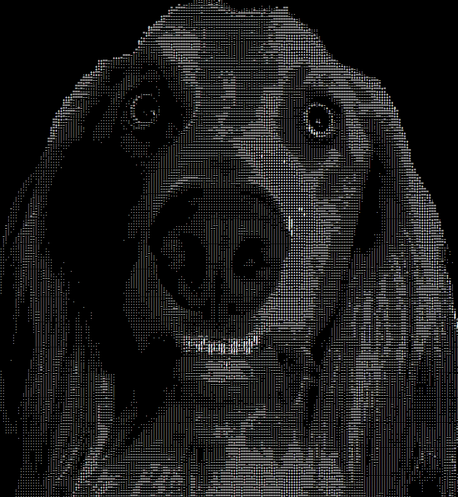

# Ascii-Images

A simple project I created years ago and never migrated.
In the code you can toggle to convert either static images or a live feed with your camera

## Important:
  This is a P5.js project use [this link](https://editor.p5js.org/HoldenErnest/sketches/kuWC2oVVV) to run it online.

